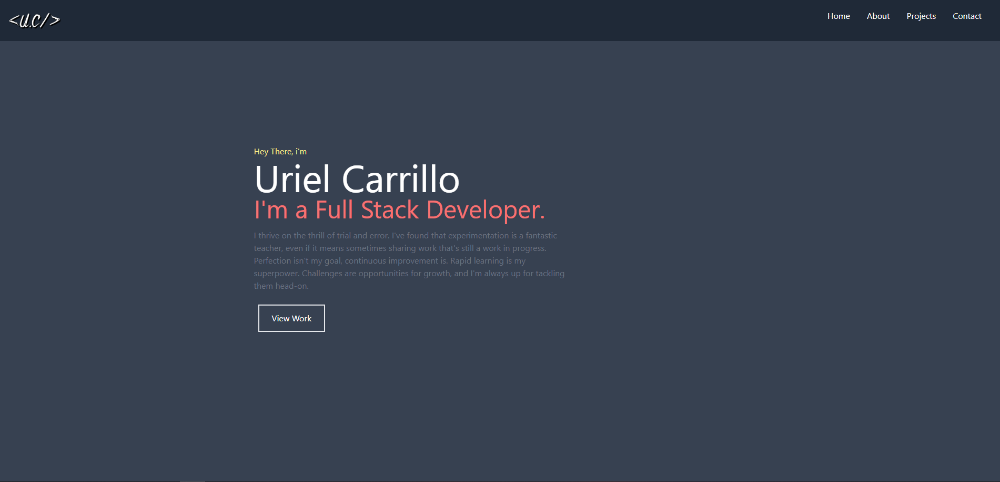

# React Portfolio

[](https://opensource.org/licenses/MIT)

## Description
Welcome to my React-powered portfolio, where innovation meets seamless navigation. Leveraging the power of React and the elegance of Tailwind, I've crafted a dynamic showcase of my web development prowess.
As you explore, you'll encounter a thoughtfully designed user interface, prioritizing intuitive navigation and a clean aesthetic. The color scheme, carefully curated beyond default palettes, adds a distinctive touch to the visual experience. Whether you're on a desktop or a mobile device, accessibility is at the forefront of my design philosophy. No matter the platform, my portfolio is tailored for a seamless viewing experience.
React:

- React: a JavaScript library for building user interfaces.
It allows developers to create reusable UI components that update efficiently in response to data changes.
React follows a component-based architecture, making it easier to manage and scale large applications.
React Icon:

- React Icons: is a library that provides a set of pre-built, customizable icons for use in React applications.
It simplifies the process of adding icons to your React components and ensures consistent styling.
React Scroll:

- React Scroll: is a library that facilitates smooth scrolling behavior in React applications.
It allows for the creation of smooth scroll effects when navigating between different sections or elements on a webpage.
Tailwind:

- Tailwind CSS: is a utility-first CSS framework that provides a set of pre-defined classes to build modern, responsive user interfaces.
It emphasizes a low-level utility approach, enabling developers to quickly style elements without writing custom CSS.
Tailwind is highly customizable and can be integrated into various frontend frameworks, including React.d

## Live Preview

Live Website: 
## Table of Contents
- [Description](#description)
- [Live Preview](#live-preview)
- [Installation](#installation)
- [License](#license)
- [Contributing](#contributing)
- [Questions](#questions)

## Installation
Follow These Steps:
```bash
git clone https://github.com/UCarr81/React-Portfolio.git

cd Develop

npm install

npm start
```
The portfolio will run in your local machine browser.

## License 
### The MIT License
[https://opensource.org/licenses/MIT](https://opensource.org/licenses/MIT)

## Contributing
If you would like to contribute to this project, please follow the guidelines outlined in the Contributing Guide.

## Questions
If you have questions or need further assistance with this project, please feel free to contact me via:
- E-Mail: CarrilloUriel81@gmail.com
- GitHub: [UCarr81](https://github.com/UCarr81)

//Yuh